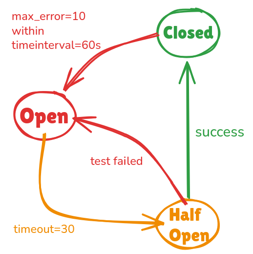

> The gateway sits in front of your microservices to provide access control, security, throttling, analytics, and much more. KrakenD is not only a proxy but a Backend for Frontend that can aggregate and transform multiple calls simultaneously, avoiding network traffic and reducing bandwidth consumer to the end-user.

KrakenD can be set up in a single `krakend.json` file. A single, massive `krakend.json` with hardcoded backends is an anti-pattern. Pros treat gateway configurations like clean, modular code.

### 1\. The Directory Structure

Instead of one file, we’re splitting gateway configuration by domain, environments, and general settings which keeps it dynamic and organized as well.

```bash
├── .env
├── .gitignore
├── docker-compose.yml
└── config/
    ├── krakend.tmpl
    ├── settings/
    │   ├── dev
    |   |   ├── hosts.json
    │   └── prod
    |       └── hosts.json
    └── endpoints/
        ├── products.tmpl
        └── users.tmpl
```

### 2\. Step-by-Step Implementation

#### Step 1: Container Orchestration (`docker-compose.yml`)

Instruct KrakenD to enable **F**lexible **C**onfiguration (`FC_ENABLE`), declare the directory where your modular endpoint templates live (`FC_TEMPLATES`), and point to your environment variables (`FC_SETTINGS`).

```javascript
services:
  gateway:
    container_name: api-gateway
    image: krakend:2.13.8
    ports:
      - "3000:3000"
    volumes:
      - ./config:/etc/krakend:ro
    environment:
      - FC_ENABLE=1
      - FC_TEMPLATES=/etc/krakend/endpoints
      - FC_SETTINGS=/etc/krakend/settings/dev
    command: ["run", "-c", "/etc/krakend/krakend.tmpl"]
    restart: unless-stopped
```

`**FC_ENABLE=1**`: Tells KrakenD to turn on the template engine.

`**FC_TEMPLATES**`: Points to the directory containing your modular template files (like your `endpoints/` folder).

`**FC_SETTINGS**`: Points to the file or directory containing your environment variables (like `hosts.json`).

#### Step 2: Environment Settings (`config/settings/dev/hosts.json`)

Use this file to store microservice host URLs and environment-specific strings, keeping them out of your main routing logic.

```json
{
  "hosts": {
    "product_service": "http://product-api:5001",
    "user_service": "http://user-api:5002"
  }
}
```

#### Step 3: Modular Endpoints (`config/endpoints/users.tmpl`)

Define template configurations using standard Go templating.

```json
{
  "endpoint": "/api/auth/register",
  "method": "POST",
  "backend": [{
    "url_pattern": "/api/auth/register",
    "host": ["{{ .hosts.user_service }}"]
  }]
},
{
  "endpoint": "/api/auth/login",
  "method": "POST",
  "backend": [{
    "url_pattern": "/api/auth/login",
    "host": ["{{ .hosts.user_service }}"]
  }]
}
```

> Notice how we reference `**"{{ .hosts.user_service }}"**`? At build time, KrakenD compiles this template and automatically swaps that placeholder with the URL from your environment settings file **(hosts.json)**.

#### Q. What is “endpoint” and “backend”?

-   **“endpoint”** = public route on KrakenD (POST /api/auth/register).
-   **“backend”** = which internal microservice handles it (user-svc:4001).

KrakenD proxies the request from **endpoint → backend**, applying rate limiting, JWT auth, and circuit breakers along the way.

#### Q. what is this `.tmpl` file?

**A:** `**.tmpl**` (Template) file is a plain text blueprint containing static configuration mixed with dynamic placeholders (like `{{ .hosts.user_service }}`).

It leverages Go’s templating engine to act as a flexible skeleton before the final configuration is compiled.

#### Example:

1.  **Template (**`**users.tmpl**`**):**

```json
"host": [ "{{ .hosts.user_service }}" ]
```

**2\. Variables (**`**hosts.json**`**):**

```json
{
  "product_service": "http://localhost:5001",
  "user_service": "http://localhost:5002"
}
```

**3\. What KrakenD actually runs in memory:**

```json
"host": [ "http://localhost:5002" ]
```

#### `Q. "host": [ "{{ .hosts.user_service }}" ]` how is it getting the user service url with that?

It works via KrakenD’s **Flexible Configuration(**FC) engine during container startup. It executes in two quick steps:

1.  **The Flag:** In your `docker-compose.yml`, you set `FC_SETTINGS=/etc/krakend/settings/dev`. This forces KrakenD to load your `hosts.json` file into memory as the core data dictionary.
2.  **The Evaluation:** As KrakenD compiles the configuration, it encounters the template syntax `{{ .hosts.user_service }}`. The dot (`.`) represents the root of your loaded `hosts.json` file. It navigates down the keys: `hosts` **→**`user_service`, extracts the string `"http://user-api:5002"`, and replaces the placeholder entirely before compiling the route.

#### Step 4: The Entrypoint (`config/krakend.tmpl`)

Tie everything together into the main skeleton. KrakenD will pull the files from your `FC_TEMPLATES` (defined in docker compose file) directory and compile them here.

```cpp
{
  "version": 3,
  "port": 8080,
  "timeout": "3s",
  "endpoints": [
    {{ template "products.tmpl" . }},
    {{ template "users.tmpl" . }}
  ]
}
```

### Now let’s go a little bit further: `**extra_config**`

extra\_config helps to enable and configure plugins, middleware, and extended features. It unlocks advanced capabilities such as security, rate limiting, logging and metrics.

#### krakend.tmpl

```cpp
{
  "version": 3,
  "port": 8080,
  "timeout": "3s",
  "endpoints": [
    {{ template "products.tmpl" . }},
    {{ template "users.tmpl" . }}
  ],
  "extra_config": {
    "telemetry/logging": {
      "level": "INFO",
      "prefix": "[KRAKEND]",
      "stdout": true
    },
    "security/cors": {
      "allow_origins": ["*"],
      "allow_methods": ["GET", "POST", "PUT", "PATCH", "DELETE"],
      "allow_headers": ["Authorization", "Content-Type"]
    }
  }
}
```

In `krakend.tmpl` we are using it for logging and security(to handle cors).

#### user.tmpl

```json
{
  "endpoint": "/api/auth/register",
  "method": "POST",
  "output_encoding": "no-op",
  "extra_config": {
    "qos/ratelimit/router": { "max_rate": 200, "capacity": 200, "every": "1s" }
  },
  "backend": [{
    "url_pattern": "/api/auth/register",
    "host": ["{{ .hosts.user_service }}"],
    "encoding": "no-op",
    "extra_config": {
      "qos/circuit-breaker": { "max_errors": 10, "interval": 60, "timeout": 30, "name": "cb-users-post-register", "log_status_change": true }
    }
  }]
},
{
  "endpoint": "/api/auth/login",
  "method": "POST",
  "output_encoding": "no-op",
  "extra_config": {
    "qos/ratelimit/router": { "max_rate": 200, "capacity": 200, "every": "1s" }
  },
  "backend": [{
    "url_pattern": "/api/auth/login",
    "host": ["{{ .hosts.user_service }}"],
    "encoding": "no-op",
    "extra_config": {
      "qos/circuit-breaker": { "max_errors": 10, "interval": 60, "timeout": 30, "name": "cb-users-post-login", "log_status_change": true }
    }
  }]
}
```

configs used in the `.tmpl` file

-   **qos/ratelimit/router:** 200 request per sec allowed
-   **qos/circuit-breaker: W**e’ll talk in detail below.
-   **output\_encoding: “no-op” (endpoint level)** : controls how KrakenD merges and returns the response to the client after gathering data from all backends.
-   **encoding: “no-op” (backend-level)** : controls how KrakenD parses/decodes the response coming from that specific backend.

#### Q. What if i don’t provide output\_encoding: “no-op”? how will this affect the response that i’ll get from the backend to api-gateway?

Without `**output_encoding: “no-op”**`, KrakenD applies its default JSON response wrapping. The response gets reformatted into KrakenD’s standard envelope.

**Example — backend returns:**

```css
{ “token”: “abc123”, “user”: { “id”: 1, “email”: “a@b.com” } }
```

With **“no-op”** — client gets exactly that, raw:

```css
200 { “token”: “abc123”, “user”: { “id”: 1, “email”: “a@b.com” } }
```

Without it (default) — KrakenD wraps it:

```css
200 { “content”: { “token”: “abc123”, “user”: { “id”: 1, “email”: “a@b.com” } } }
```

#### Circuit Breaker

It’s job is to **STOP** KrakenD from sending requests to a failing service, giving that service time to recover and preventing a total system crash.

```json
"extra_config": {
      "qos/circuit-breaker": {
        "max_errors": 10,
        "interval": 60,
        "timeout": 30,
        "name": "cb-users-post-login",
        "log_status_change": true
      }
}
```

How above specific setting works



**Closed:** Closed is a healthy state, it means circuit breaker is close and requests can pass normally.

**Open:** If KrakenD counts `max_error`(10 errors) within `time interval`(60s), it blocks all the requests to the backend server.

**Half Open:** After the 30-second `timeout` expires, the circuit breaker enters the Half-Open state. In that state, it allows to pass limited number of requests to test if the backend is actually stable. If the test passes, Circuit Breaker goes in **Close state** else goes in **Open state.**

Some unexplained configs in the circuit breaker

`**name**` **:** A friendly name to follow this circuit breaker’s activity in the **logs**.

`**log_status_change**`: Whether to log the changes of state of this circuit breaker or not. Default to `false` .

### More features provided by KrakenD

**Data Manipulation & Aggregation:** Merge multiple microservice responses into a single JSON object.

**Authentication Offloading:** Native JWT validation plugins allow the gateway to reject unauthorized requests at the edge before they even touch your internal networks.

**Response Caching:** In-memory or Redis caching options.

**Comprehensive Metrics:** Native integration with Prometheus, Jaeger, OpenTelemetry, and ELK stack for plug-and-play system visibility.

> As I implement more features, I’ll update this setup. How are you currently managing your API Gateway configurations? Let me know in the comments!

### Have a nice day!
