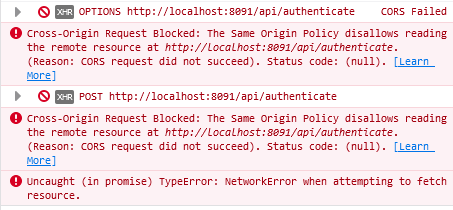
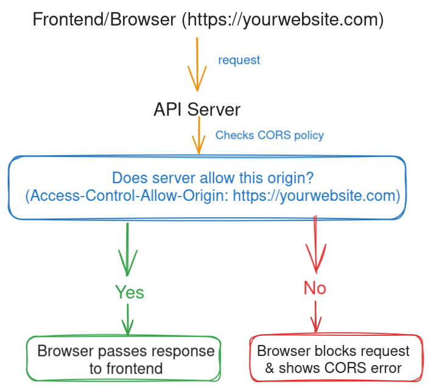

If you’ve been working with APIs for even a little while, you’ve probably run into this message:



For most developers, seeing a CORS error feels like hitting a brick wall. But relax — your browser isn’t trying to break your code. It’s just doing its job and keeping things safe.

#### What Even *Is* CORS?

CORS stands for **Cross-Origin Resource Sharing**.

Your browser follows something called the **Same-Origin Policy**, which basically says:

> “I will only allow a website to request data from the same place it came from — unless that other place says it’s okay.”

**Think of it like this:** your browser is airport security — only people with the right boarding pass get through.

> “No pass, no entry.”

That **“boarding pass”** is what CORS provides.

#### Why Does This Even Exist?

Security. Plain and simple.

Without CORS, any website could start making requests to your bank’s API in the background and steal your money while you’re browsing the web.

Browsers enforce this rule to keep shady websites from secretly making requests on your behalf.

#### How Does CORS Work?



When your frontend tries to call an API from a different domain, your browser asks:

> “This site wants to talk to you — should I let it?”

The API server can respond with headers like:

```bash
Access-Control-Allow-Origin: https://yourwebsite.com
```

This is the server saying:

> “Yes, I trust requests from `yourwebsite.com`. Go ahead.”

If the server doesn’t send that header, the browser blocks the request and shows you that big red CORS error.

#### The Usual Fix (and the Usual Pain)

Here’s the catch: **CORS is not a frontend issue.**
You cannot fix it by yelling at your JavaScript code.

You fix it on the **server** side by allowing certain domains.

Example in an **Express.js** server:

```javascript
import express from "express";
import cors from "cors";

const app = express();

// Allow requests from any origin (good for testing, not production)
app.use(cors());

// OR be specific (recommended for production)
app.use(cors({
  origin: "https://yourwebsite.com"
}));

app.get("/api", (req, res) => {
  res.json({ message: "CORS is happy now!" });
});

app.listen(3000);
```

#### TL;DR

-   CORS is your browser checking that requests are safe.
-   A CORS error means the server hasn’t said, *“I trust this site.”*
-   The fix always happens on the server, not in your frontend.
