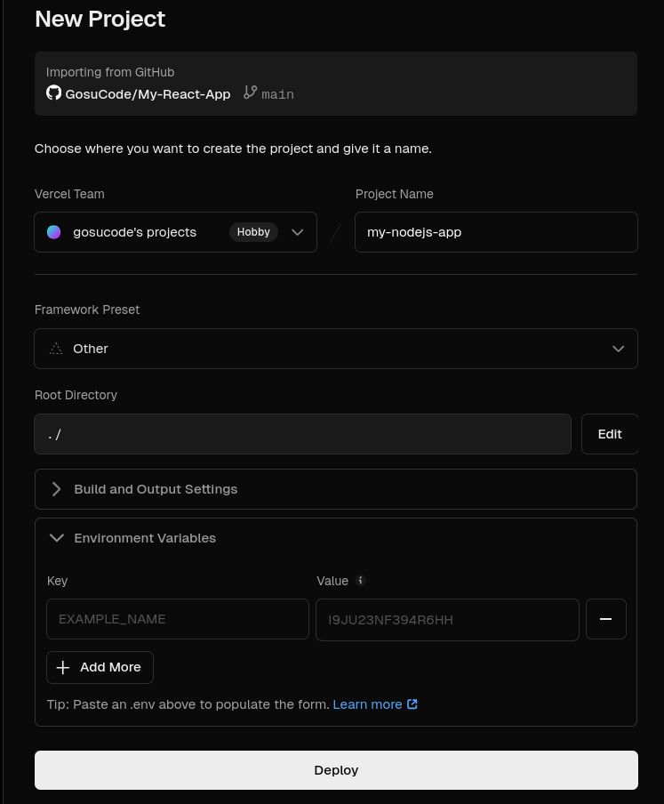

**Why Choose Vercel for Your Node.js App?**

-   **Free Tier:** With sufficient bandwidth and function calls to get you started, Vercel’s Hobby plan is excellent for home projects.
-   **Serverless:** It executes your Node.js code as serverless functions, which are largely free, auto-scaling, and require no servers to maintain.
-   **Git Integration:** Vercel builds and deploys your code; all you need to do is push it to GitHub.
-   **Global CDN:** For quick worldwide access, serverless functions and static files are supplied from edge locations.
-   **Dev Experience:** The workflow, CLI, and dashboard are easy to use and intuitive for developers.

#### **Prerequisites**

Before we start, make sure you have:

-   A Node.js application ready.
-   Node.js and npm (or yarn) installed locally.
-   A Git repository (hosted on GitHub, GitLab, or Bitbucket).
-   A free Vercel account (Sign up at [**vercel.com**](https://vercel.com/)).

### **Step-by-Step Deployment Guide**

#### **Step 1: Prepare Your Node.js App**

Vercel needs to know how to run your application.

#### **vercel.json**

Create a `**vercel.json**` file in your project root. This tells Vercel explicitly how to build and route your application.

**Example vercel.json (Routing all requests to api/index.js):**

```json
{
  "version": 2,
  "builds": [
    {
      "src": "src/index.js", // Or your main server file
      "use": "@vercel/node"
    }
  ],
  "routes": [
    {
      "src": "/(.*)",
      "dest": "src/index.js" // Or your main server file
    }
  ]
}
```

#### **Step 2: Push Your Code to Git**

Commit your latest changes and push them to your preferred Git provider (GitHub, GitLab, Bitbucket).

```sql
git add .
git commit -m "Prepare for Vercel deployment"
git push origin main
```

#### **Step 3: Import Project on Vercel**

-   Log in to your Vercel dashboard.
-   Click “Add New…” -> “Project”.
-   Import your Git repository by selecting the provider and choosing your project. Vercel will ask for repository permissions if this is your first time.

#### **Step 4: Configure Your Project**



-   **Framework Preset:** No need to specify.
-   **Build & Output Settings:** Usually, Vercel figures this out.
-   **Root Directory:** Ensure this points to the root of your Node.js project within the repository (usually the default is correct).

#### **Step 5: Add Environment Variables (If Needed)**

If your application requires API keys, database connection strings, or other secrets:

-   Expand the “Environment Variables” section during project setup (or go to Project Settings > Environment Variables later).
-   Add your variable names (e.g., `**DATABASE_URL**`, `**API_KEY**`) and their corresponding values.
-   Choose the environments (Production, Preview, Development) where they should apply.

#### **Step 6: Deploy!**

-   Click the “**Deploy**” button.
-   Vercel will fetch your code, install dependencies, build the project (if configured), and deploy it to its infrastructure. You can watch the build logs in real-time.

#### **Step 7: Access Your Deployed App**

Once deployment is complete (usually takes a minute or two), Vercel will provide you with:

-   A unique deployment URL (e.g., `**my-node-app-git-main-username.vercel.app**`)
-   Links to view the build logs and source code.

**Congratulations!** Your Node.js application is now live on the internet, hosted for free by Vercel.

**Understanding Free Tier Limitations**

Vercel’s Hobby plan is powerful but has limits. Be aware of:

-   **Bandwidth:** 100 GB per month.
-   **Serverless Function Execution:** Limits on CPU time per month and execution duration per invocation (e.g., 10 seconds for Hobby).
-   **Builds:** A cap on concurrent builds and total build hours per month.
-   **Commercial Use:** The Hobby plan is intended for personal, non-commercial projects.

Check the official [Vercel Pricing Page](https://vercel.com/docs/plans) for the most up-to-date limits.

### **Conclusion**

Vercel offers a very efficient and economical method of deploying Node.js applications. It is an excellent choice for developers who want to rapidly and easily get their projects online because of its serverless architecture, strong Git integration, and generous free tier. Try it out for your next project with Node.js!
