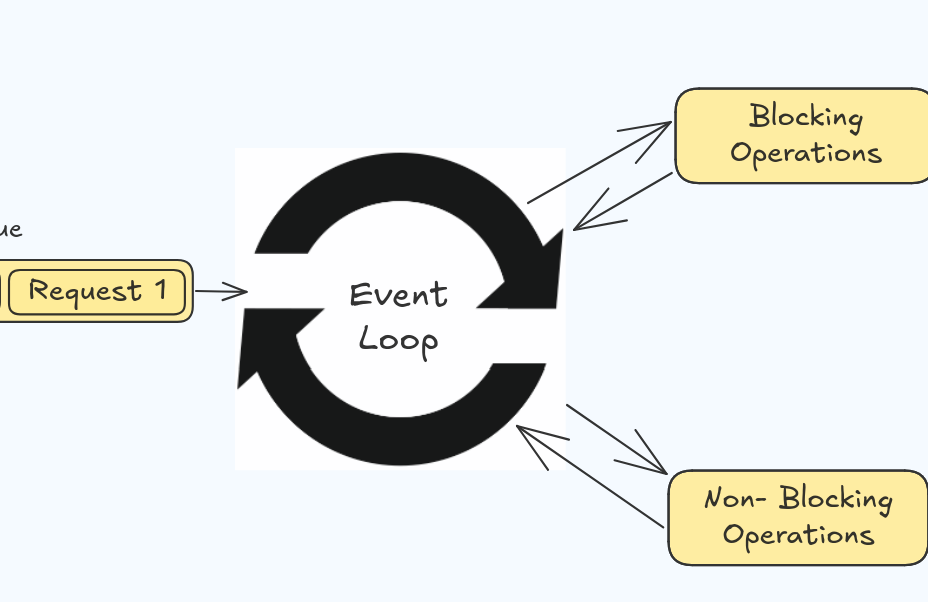
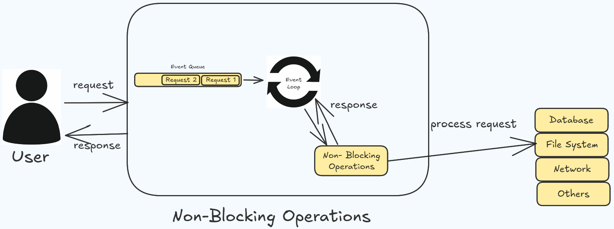
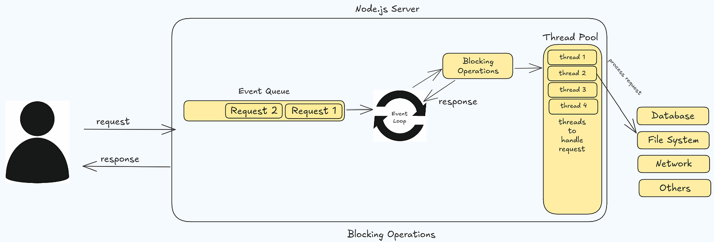

#### NodeJS Architecture

It starts with a client/user. The user makes request to the server.

#### How the nodejs server handle request?

When a client sends a request to nodejs server, it’s queued in **Event Queue**.

#### Where do all the requests go after Event Queue?

All queued requests are sent to **Event Loop**.

#### What is an Event Loop and what does it do?

It’s a loop or mechanism that always keeps watch on **Event Queue** for request that are there. And if there are any request it picks the request on the basis of first in first out(**FIFO**). It delegates blocking tasks to the Thread Pool and non-blocking tasks to system APIs or external services. Once a task completes, the Event Loop processes the callback and sends the response to the user.



#### **There are two types of request**

1.  Blocking Operations(Synchronous Task)
2.  Non-Blocking Operations(Asynchronous Task)

> The Event Loop checks the Event Queue, delegating blocking tasks to the Thread Pool and non-blocking tasks to system APIs or external services like the file system, network, or database.

#### What if it’s a non-blocking operation?

Server process it and sends back response to the user.



#### What if it’s a blocking operation?

The request is sent to **Thread Pool.**



#### **What is a Thread Pool?**

It’s a collection of threads. Thread is like a worker that are responsible for fulfilling the request. So, every request is assigned a thread to do the work(fulfill request).

But before assigning the request to the thread, because there a limited numbers of thread(by default 4 and can be adjusted). **Thread pool** checks if there are any threads(worker) available in the **thread pool.** If thread is available then thread pool assigns the thread to the request. After the thread fulfills the request, the thread return to the thread pool and then return the result to **event loop**. That result is then sent to the user as a response.

#### **Let’s Understand this by practical example:**

Let’s suppose you have a text file that you need to read.

#### Non-Blocking Operation (Asynchronous Task):

```javascript
const fs = require("fs");

console.log('Starting');
fs.readFile('large-file.txt', 'utf-8', (err, data) => {
  console.log(data);
});
console.log('Continuing execution');
```

Now, when you run the above program what will be the outcome?

```bash
Starting
Continuing execution
Large file data
```

As you can see, the data that we read is printed last. It’s because the `readFile` is a non-blocking, asynchronous task.

The main thread continues executing the next line of code `console.log('Continuing execution')`, without waiting for the file reading to complete. When the file reading is done, the callback function is executed, and the data is printed.

#### **Blocking Operation (Synchronous Task):**

```javascript
const fs = require("fs");

console.log('Starting');
const data = fs.readFileSync('large-file.txt', 'utf-8');
console.log(data);
console.log('Continuing execution');
```

What will be the outcome?

```kotlin
Starting
Large file data
Continuing execution
```

The `readFileSync` operation is a blocking, synchronous task. The Event Loop recognizes this and assigns the request to the Thread Pool.

The main thread waits for the file reading to complete before continuing to the next line of code. This blocks the Event Loop and prevents other requests from being processed until the file reading is done.

#### That’s it!

Understanding these things are important for writing efficient and scalable applications. If you found value in this blog or if there’s anything you think I missed, please don’t hesitate to drop your thoughts in the comments below. Your feedback is immensely valuable, and I encourage you to share your insights, ask questions, or point out any mistakes you may have notices.
